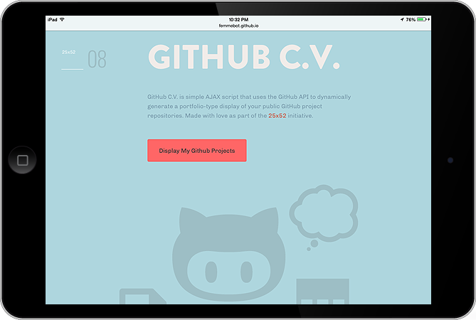

GitHub C.V. is a simple AJAX script that dynamically generates a portfolio page of your public GitHub repositories. This was inspired by a conversation I had with [Giff Constable](http://twitter.com/giffco) about how platforms like GitHub can replace online portfolios because they offer a better glimpse of your work. Q.E.D.

There&rsquo;s a saying that &ldquo;If you are not embarrassed by the first version of your product, you&rsquo;ve waited too long.&rdquo; Well, this is the first version, and it&rsquo;s a bit embarrassing.

Feel free to [dig into the script](https://github.com/femmebot/GitHub-Project-CV). I would love to hear feedback on how to make improvements.

