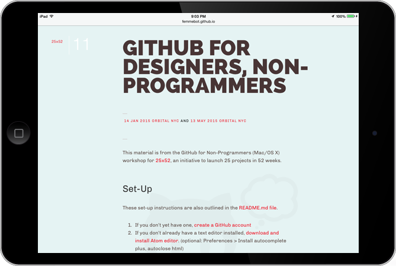

In this hands-on workshop for [designers](https://githubfordesigners.splashthat.com) and [non-programmers](https://www.eventbrite.com/e/github-for-non-programmers-mac-tickets-16869532225), participants were taught how to take advantage of Git with GitHub's excellent distributed version-control capabilities and collaboration features to host and share their own open-source, non-technical projects.

