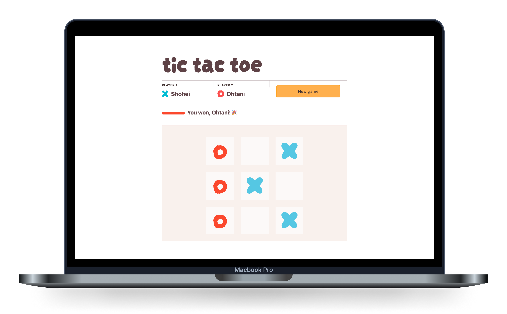

The classic, turn-based game written in pure JavaScript as a client app. Inspired by [100 Days of Web Development](https://100daysofwebdev.com).

Play the game: [Tic Tac Toe](https://25x52.com/tic-tac-toe/)

Fork it on GitHub: [https://github.com/25x52/tic-tac-toe](https://github.com/25x52/tic-tac-toe)

