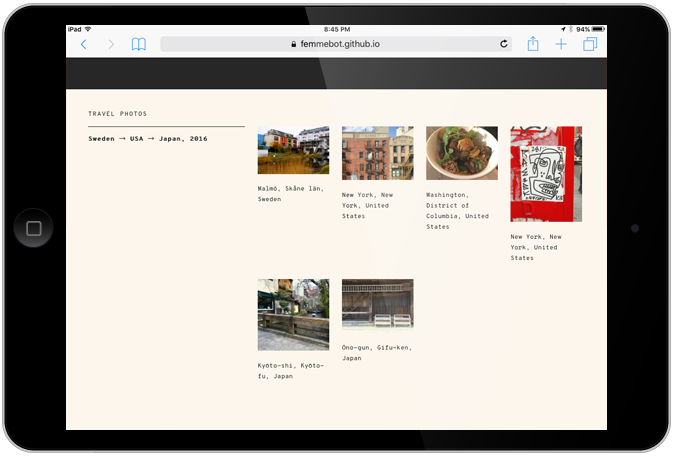

A Python script that extracts your photos' EXIF GPS data to identify the location (town, city, country) where your photos were taken from. Use it to quickly catalog large batches of photos (.jpg with EXIF GPS location enabled) and [label each photo with their location](https://femmebot.github.io/travel-exif/).

